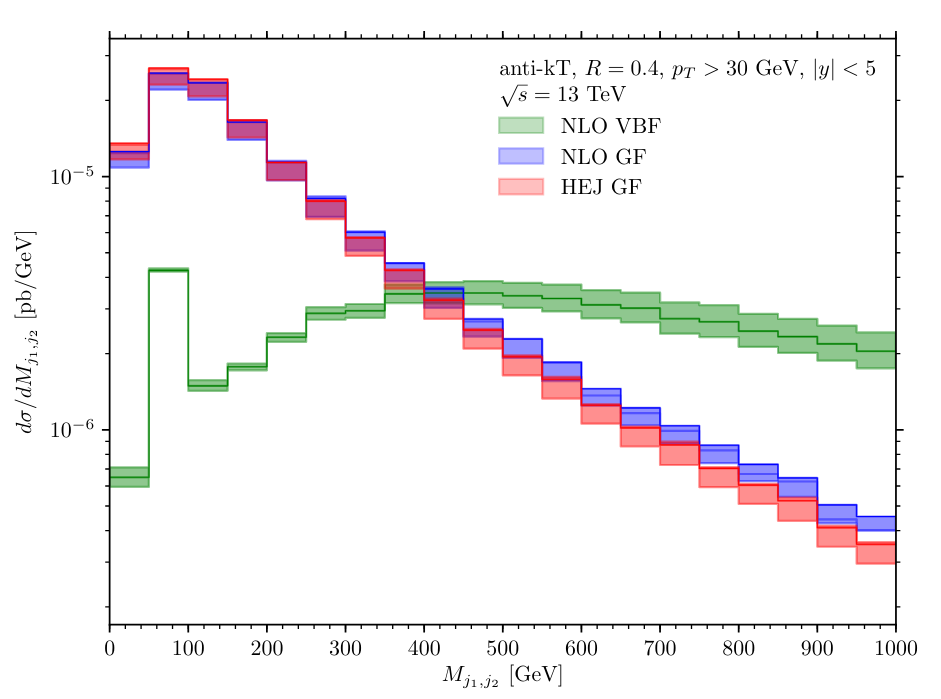

I have been privileged to have had ample opportunity during my academic career to present my research to a wide range of audiences including **laypersons** unfamiliar with my research, other **postgraduate researchers** and **senior academics**.

My presentations have always prompted productive discussion and incurred positive developments in the communities I give them - many have complimented the **easily comprehensible** design of my slides and my **engaging diction** when presenting as well as the well thought-out interactive nature of my computing talks.

Here I list presentations given throughout my time as a Ph.D. candidate at Durham University.

---

 

<h4>All-Order Merging of High Energy and Soft-Collinear Logarithms</h4>

<small>4th August 2022 ––– International Symposium on Multiparticle Dynamics (ISMD) 2022 ––– Atholl Palace Hotel, Pitlochry, Scotland</small>

I was **invited** to present my research (in collaboration with my supervisor [JRA](https://www.ippp.dur.ac.uk/profile/andersen) and [SJ](https://www.ippp.dur.ac.uk/profile/sjaskiewicz/)) at the 51st [ISMD](https://indico.cern.ch/event/1015549/) in the Scottish Highlands.

I prepared and gave a 20+5 minute talk to an audience of roughly eighty people from a **wide range of backgrounds** in the field, during the *Forward and Diffractive Physics* stream.

    

        
    

The slides were very well-received by the audience and the **clarity** of their **design** and of my spoken presentation were both highly commended and the talk itself prompted much productive discussion.

My slides are available on [indico](https://indico.cern.ch/event/1015549/contributions/4903854/attachments/2488546/4275047/ISMD-HEJ-Pythia.pdf).

 

---

 

<h4>Investigating the W Mass with Herwig</h4>

<small>24th June 2022 ––– MCNet Summer School 2022 ––– Hotel Belvedere, Zakopane, Poland</small>

At this MCNet summer school we (the attendees) were assigned group projects on determining the mass of the W boson from mock data using Monte Carlo event generators.

As part of the group assigned to [HERWIG](https://herwig.hepforge.org/) I produced the presentation material following our investigation and presented these to the full in-person group of roughly eighty people.

    

        
    

This was a productive exercise in informing my perspectives on presenting work produced within a **large collaboration** which allowed me to further develop my **management** and **communication** skills.

My slides and the investigation results are available on a shared [repository](https://github.com/jcwhitehead/MCNet2022_herwig_Wmass/blob/master/presentation) along with a record of the discussion points raised. 

 

---

 

<h4>Python Projects and Unit Testing</h4>
<small>22nd February 2022 ––– IPPP Computing Club Seminar ––– Durham University</small>

I gave an **interactive** presentation to postgraduates and academic staff on **good coding practice** including:

- Exporting **Python** code as a local package. 

- The importance and practical implementation of **unit testing**. 

- Adhering to coding **style guides** and using **linter** tools etc. 

- Writing and using **unit tests** as a guide for instructing development i.e. **test-driven development**. 

- Introductory implementation of **Continuous Integration/Delivery** workflows with **GitHub Actions**. 

This talk was pitched to all levels, the aim being that attendees of all backgrounds could stand to gain something from the presented material, which is available on [GitHub](https://github.com/Hitham2496/Subtractor).

 

---

 

<h4>Debugging C++ with <code>gdb</code></h4>
<small>21st November 2021 ––– IPPP Computing Club Seminar ––– Durham University</small>

I presented to postgraduate students and academic staff the importance of **debugging** when developing code and how to use tools such as <code>gdb</code> in **Linux/Unix** systems to debug practically.

The focus of the talk was on common bugs in **C++** in the context of High Energy Physics (HEP) calculations.

The presentation contained an **instructive** and **interactive** component wherein attendees used gdb to trace through a toy **C++** implementation of a basic calculation in HEP to find the source of a nan-valued output in the calculation.

The presented material - available on [GitHub](https://github.com/Hitham2496/debugging-presentation) - was well received by the audiences and many of those who attended have returned to review the talk to help with their own work following the presentation.

 

---

 

<h4>Jet Multiplicity Measurements at the LHC</h4>
<small>24th November 2019 ––– St. Cuthbert’s Society Research Forum ––– Durham University</small>

I was invited to present my Masters thesis project to academic staff and students without a physics background at St. Cuthbert’s Society, Durham University.

I presented to this audience the **core concepts**, **aims** and **achievements** of my Masters research project *Jet Multiplicity Measurements at the LHC*.

This meant **adapting** the material of my research and being decisive in the **selection** of pertinent details when **communicating the complex science** that my research concerned and responding to questions.

This was my first foray into presenting the results of my research as a Ph.D. student was an invaluable learning experience.

The feedback I received from the convener (Prof. Elisabeth Archibald, then principal of St. Cuthbert's Society) and the audience was **overwhelmingly positive**, with everyone leaving the session with a clear impression of the relevant aspects of my research. 
